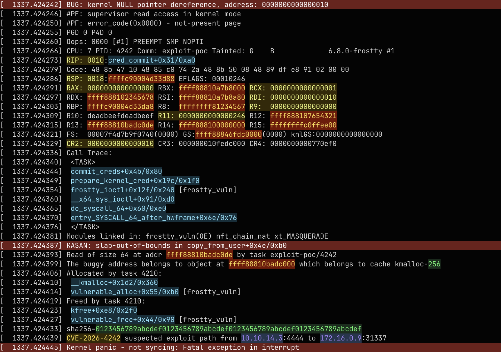
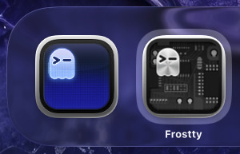

# Frostty

Frostty is a quick and dirty hack of [Ghostty](GHOSTTY.md), tailored for
vulnerability research.

The goal is not to fork Ghostty into a general-purpose terminal. The goal is to
keep Ghostty's speed and native macOS behavior while adding low-friction visual
triage features for exploit development, kernel debugging, log review, etc. One
can also hack this hack for a different usage.

_**NOTE**_: Tested on macOS only. Do not expect anything from this project, I
just published it for fun. It will mess with colorschemes of your favorite
terminal applications.



## Current Features

Frostty currently adds persistent regex-based highlights for visible terminal
output.

Rules are configured with the normal Ghostty config syntax:

```conf
highlight = name=sha256 type=token regex="\b[A-Fa-f0-9]{64}\b" fg="#50fa7b" bg="#12351f" priority=900
highlight = name=kernel-oops type=line regex="\b(BUG:|Oops:|Kernel panic)\b" fg="#ffffff" bg="#7f1d1d" priority=1100
```

Supported rule modes:

- `type=token`: highlights the exact regex match.
- `type=line`: highlights the whole logical line when the regex matches.

Supported rule fields:

- `name`: stable rule identifier.
- `regex`: Oniguruma regex.
- `fg`: optional foreground override.
- `bg`: optional background override.
- `priority`: higher priority wins on overlap.
- `enabled`: set to `false` to keep a disabled rule in config.

The renderer scans visible logical lines, including soft-wrapped rows. This
means long IOCs such as SHA-256 values can still match when wrapped across
multiple visual rows.

### Runtime Value Tracking

Frostty can promote the current terminal selection into a temporary highlight
rule. This is meant for values discovered during live analysis: leaked pointers,
heap chunk addresses, request IDs, PIDs, TIDs, nonces, hashes, kernel symbols,
or any other value that becomes interesting while reading output.

Bind the actions in `~/.config/frostty/config`:

```conf
keybind = ctrl+shift+h=highlight_selection
keybind = ctrl+shift+backspace=clear_runtime_highlights

highlight-selection-foreground = #000000
highlight-selection-background = #ffaf00
```

Typical workflow:

```text
1. A leak appears in the terminal: 0xffff88810a7c9000
2. Select the value.
3. Trigger highlight_selection.
4. Frostty highlights visible and future occurrences of that exact value.
```

`highlight_selection` creates an in-memory literal token rule. The selected text
is escaped before compilation, so regex metacharacters are not interpreted:

```text
0xffff88810a7c9000
chunk[0x5555558123a0]
SHA256:abcd...==
```

Runtime highlights are not written to disk and do not modify the terminal
buffer, scrollback, or copied text. Use `clear_runtime_highlights` to remove all
runtime rules while keeping static rules from `config` and `patterns`.

Current constraints:

- selections are trimmed at the edges;
- empty selections are ignored;
- hard multiline selections are ignored;
- selections larger than 4096 bytes are ignored;
- runtime highlights use one global foreground/background style.

## Configuration

Frostty reads:

```text
~/.config/frostty/config
~/.config/frostty/patterns
```

`config` is the main Frostty config (identical to Ghostty). `patterns` is optional
and loaded after `config`, which is useful for keeping large highlight rule sets
separate.

Theme lookup also checks:

```text
~/.config/frostty/themes
```

before falling back to Ghostty's normal user and bundled theme locations.

## Examples

- [frostty/HIGHLIGHTS.md](frostty/HIGHLIGHTS.md): larger catalog of example
  highlight rules for vulnerability research.
- [frostty/kernel-patterns](frostty/kernel-patterns): focused kernel crash and
  pointer rules.
- [frostty/example.txt](frostty/example.txt): synthetic terminal output for
  screenshots and visual checks.

## Building

Use the Frostty build wrapper:

```sh
./frostty/build-macos.sh --icon XrayImage
```

By default, it is using an alternative icon so it is easy to distinguish Frostty
from Ghostty in Dock and application switcher.



Build and packaging details are documented in [frostty/README.md](frostty/README.md).
The wrapper also has an experimental Linux path that builds the GTK binary into
a local prefix and exposes it as `bin/frostty`:

```sh
./frostty/build-linux.sh
```

The Linux script uses local `zig 0.15.2` when available and otherwise retries
inside the repo Nix dev shell.

On Linux/GTK, set Frostty's application class so it can coexist with Ghostty:

```conf
class = com.mitchellh.ghostty.frostty
```

## Limitations

Frostty is intentionally packaged as a lightweight local app wrapper around the
Ghostty macOS bundle.

The app is renamed and uses a distinct bundle identifier:

```text
CFBundleName = Frostty
CFBundleIdentifier = com.mitchellh.ghostty.frostty
CFBundleExecutable = frostty
```

This is good enough for local vulnerability research workflows and keeps the
hack small, but it is not a fully independent macOS product identity. Finder,
Dock, and LaunchServices can distinguish Frostty from Ghostty, but System
Settings permissions and TCC state may still behave inconsistently depending on
signature, install path, and rebuild history.

The build script signs the app ad hoc and writes it to `/private/tmp` by
default. Rebuilt copies may be treated by macOS as new local apps. A stronger
separation would require auditing Ghostty-specific runtime identifiers and
signing with a stable identity.

## Upstream

The original Ghostty README has been preserved as [GHOSTTY.md](GHOSTTY.md).
